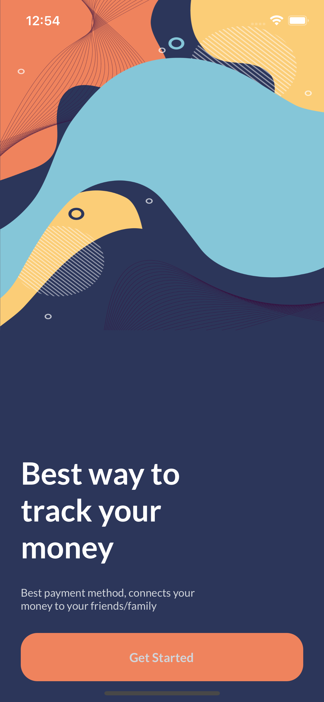
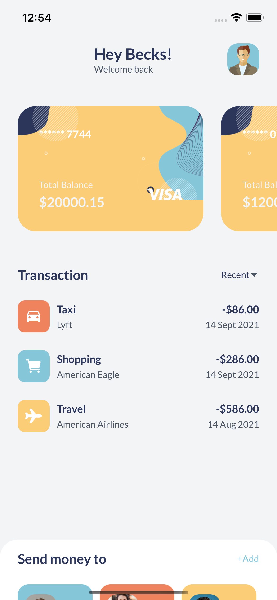
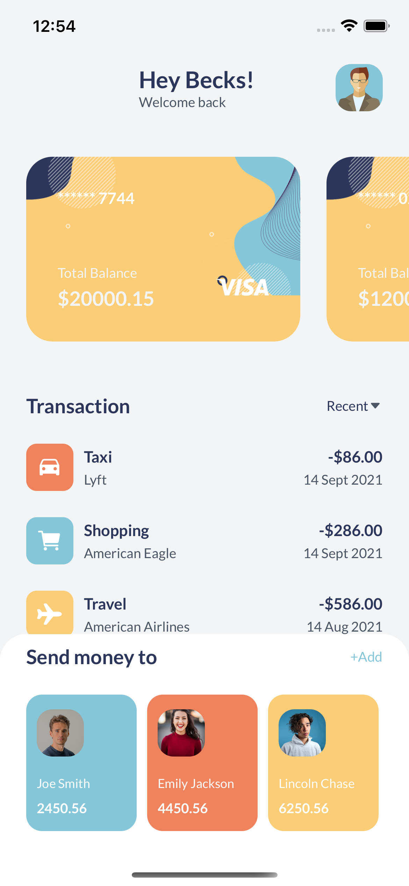
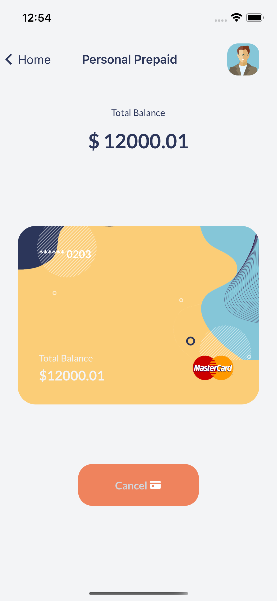

# MoneyBag: A React Native TypeScript Tutorial Project

## App Features

Using the tutorial ["Create A React Native TypeScript Project | A Beautiful Wallet App Design" by ToThePointCode on Youtube](https://youtu.be/68l7wyHw97Y), I created this React Native TypeScript project. This tutorial utilizes the front-end only, so there isn't any back-end functionality.

### Welcome Screen

This welcome screen is the first screen users see upon starting the app. Upon pressing the Get Started button, users are brought to the Home screen.

### Home Screen

The Home Screen includes three features:

- Cards, which showcase different debit/credit cards and their respective balances
- Transactions, which showcase recent costs accrued
- Send Money, an adjustable sheet at the bottom of the screen that shows acquaintances a user can send money to

 

Upon clicking one of the cards at the top of the screen, the user is brought to that card's Balance screen.

### Balance Screen

The Balance Screen shows the amount on the respective card, a larger version of the card visual on the Home Screen, and a cancel button. The cancel button does not currently have any functionality.

## Running the App

After cloning this application, one can run this locally by navigating to the project and running `yarn i` in the Terminal.
